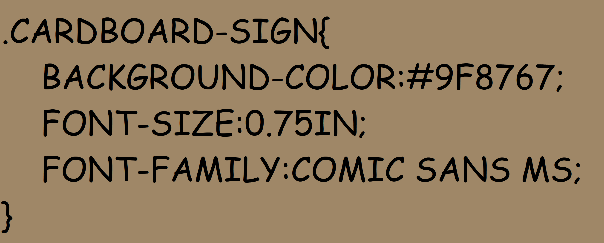

## [RETURN TO MAIN BOOK](read-markdown-file.php?filename=book.md)
## [EDIT THIS CHAPTER](edit-markdown-file.php?filename=css.md)

# TRASH MAGIC CSS

## WHAT IS CSS?

CSS SANDS FOR "CASCADED STYLE SHEETS", AND IT IS THE LANGUAGE WHICH TELLS BROWSER HOW A WEB DOCUMENT SHOULD LOOK. IT CAN BE EITHER INSERTED IN A STYLE ELEMENT OR ADDED WITH A LINK ELEMENT. 

IN TRASH MAGIC WE USE CERTAIN PIECES OF CSS CODE REPEATEDLY TO GIVE ALL THESE DOCUMENTS A CERTAIN LOOK AND FEEL!

DIRT WIZARD IS UNSKILLED WITH CSS, HOWEVER!

THIS IS VERY CRUDE CSS!

CSS CAN BE CAPS OR LOWER CASE IN MOST SITUATIONS!

## USEFUL LINKS

 - [CSS WIKIPEDIA PAGE](https://en.wikipedia.org/wiki/CSS)
 - [W3 SCHOOLS CSS TUTORIAL](https://www.w3schools.com/css/)
 - [MOZILLA DEVELOPER NETWORK CSS INFO](https://developer.mozilla.org/en-US/docs/Web/CSS)
 - [W3C (OFFICIAL WEB ORG) INFO ABOUT CSS](https://www.w3.org/Style/CSS/)
 - [SEE AMAZING CSS ART SHARED FREELY ON CODE PEN](https://codepen.io/)
 - [trashmagic.css](trashmagic.css)
 
## TRASH MAGIC CSS CODE

COMIC SANS!

ALL CAPS!

CARDBOARD SIGNS!

```
BODY{
    FONT-FAMILY:COMIC SANS MS;
}
```

There is no point attempting to create a whole CSS tutorial here. I recommend the tutorial at w3schools linked above to learn the basics, and codepen to get an idea of what is possible and learn tricks from the experts.  I strongly urge people to go learn the basics and try some stuff to get the hang of it, then come back and read some of the CSS that we use in Trash Magic web pages to get a feel for how it works. Be aware that I am bad at CSS an my CSS code is not good. But it works! And you can make web pages do what you want after a little bit, making really original and interesting looking pages with just a couple lines copy/pasted from some other existing page.

What I will do in this scroll is simply share some patterns we use commonly in Trash Magic so that they can be easily replicated.

The most basic CARDBOARD HYPERTEXT element is to make the background color that of cardboard.  This uses [hexidecimal color](https://en.wikipedia.org/wiki/Web_colors) #9f8767. This color is perhaps the single most important bit of CSS in Trash Magic, although a close second is the font [Comic Sans MS](https://en.wikipedia.org/wiki/Comic_Sans) and also making things huge, because taken together(brown background, Comic Sans font, huge letters), we have a whole cardboard sign effect.  


Here is an example of a very simple cardboard sign style which styles a whole web page like a cardboard sign:

```
<style>
body{
    background-color:#9f8767;
    font-size:0.75in;
    font-family:Comic Sans MS;
}
<style>
```

Here is what that looks like in cardboard and HTML, pointing out the duality of cardboard that looks like html and html that looks like cardboard:




What are some other Trash Magic styles?

One good simple one is retro green screen, which is useful for things like text areas and inputs where a user will input some text. It makes things look like, well, retro green screens.  


To make your inputs and textareas look like this, use the following code snippet:

```
<style>
input,textarea{
    font-family:courier;
    color:#00ff00;
    background-color:black;
}
<style>
```


 